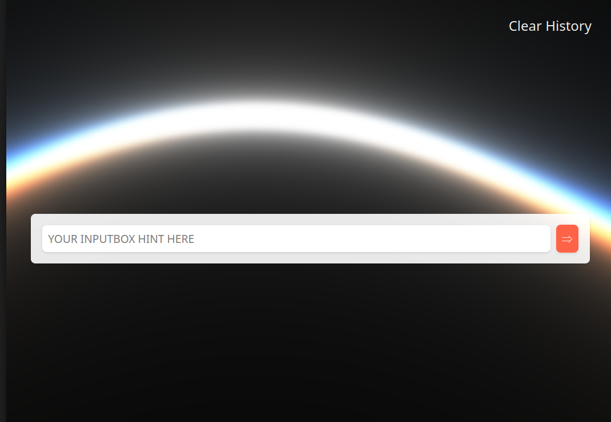

# AI Chatbot Template

<p align="center">
  
</p>


## Description

This is a simple template for hosting your own AI chatbot. 


## Getting Started

* Edit app.py to add your OPENAI key & custom prompt
* Edit /templates/index.html to name your chatbot

### Install / Run
```
chmod +x start.sh
./start.sh
It will be running on all network interfaces @ port 5000
```


### Dependencies

* Python
* Pip
* Venv
* OpenAI
* Flask
* Gunicorn


